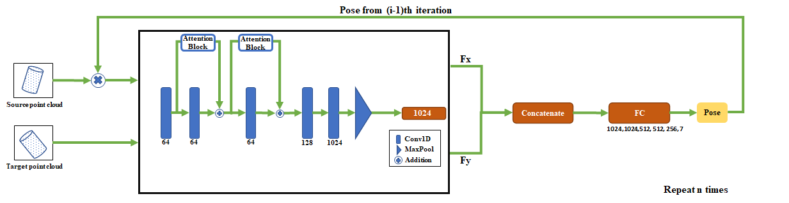

# RPM-Net: Robust Point Matching using Learned Features



This is the project webpage of our work AttentionPointResnet. AttentionPointResnet is a deep-learning approach designed for performing end-to-end rigid  point cloud registration for objects in a iterative fashion. Our paper can be found on [Arxiv](https://arxiv.org/abs/2003.13479) ([supplementary](https://arxiv.org/src/2003.13479v1/anc/supplementary.pdf)).

```
@inproceedings{yew2020-RPMNet, 
    title={RPM-Net: Robust Point Matching using Learned Features}, 
    author={Yew, Zi Jian and Lee, Gim Hee}, 
    booktitle={Conference on Computer Vision and Pattern Recognition (CVPR)},
    year={2020} 
}
```

## Prerequisites

See `requirements.txt` for required packages. Our source code was developed using Python 3.8 with PyTorch 1.8. Pytorch3d requires importance in installation.

## Training

Run the appropriate jupyter notebooks to train the different network with any desired loss function. We use the processed ModelNet40 dataset from [PointNet](https://github.com/charlesq34/pointnet) for this work, which will be automatically downloaded if necessary.
## Pretrained models

Our pretrained models can be downloaded from [here](). You should be able to obtain the results shown in the paper by using these checkpoints.